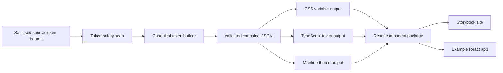

# Design system pipeline demo repo documentation

This documentation pack describes how to build a public demo repository from the sanitised design-token fixtures through to canonical tokens, generated Mantine theme output, a React component package, Storybook documentation, and an example React application.

The intended repository is a demo and engineering proof of concept. It must use only sanitised fixture tokens, generic names, generic sample content, and open-source dependencies. Do not copy raw work token exports, private font files, brand assets, screenshots, internal naming, or original colour values into the public repo.

## Target outcome

The finished repo should demonstrate an end-to-end design-system pipeline:



The repo should be able to run:

```sh
pnpm install
pnpm build
pnpm test
pnpm storybook
pnpm --filter @demo-ds/example dev
```

## Recommended monorepo shape

Use a pnpm workspace with package-level build tasks. Turborepo is optional but useful once there are multiple packages and apps.

```txt
apps/
  example/
  storybook/
packages/
  token-pipeline/
  tokens/
  mantine-theme/
  components/
docs/
  ...these files...
AGENTS.md
package.json
pnpm-workspace.yaml
turbo.json
```

## How to use this pack

1. Create a new public or private GitHub repo.
2. Copy this documentation pack into the repo root.
3. Copy the previously generated `sanitised-design-token-fixtures.zip` into a safe fixture area, for example `packages/tokens/fixtures/`.
4. Use `docs/12-codex-work-plan.md` and the prompt files in `docs/codex/` to drive Codex in small, reviewable implementation tasks.
5. Keep `AGENTS.md` in the repo root so Codex has durable project instructions.

## Documentation map

| File | Purpose |
| --- | --- |
| `AGENTS.md` | Root instructions for Codex and other coding agents. |
| `docs/00-product-vision.md` | What the demo repo is trying to prove. |
| `docs/01-target-repo-structure.md` | Proposed monorepo layout and package boundaries. |
| `docs/02-token-source-and-sanitisation.md` | Rules for using the sanitised fixtures safely. |
| `docs/03-canonical-token-model.md` | Canonical token contract and naming rules. |
| `docs/04-token-build-pipeline.md` | End-to-end build stages and script responsibilities. |
| `docs/05-generated-token-outputs.md` | CSS, TypeScript, JSON, and documentation outputs. |
| `docs/06-mantine-theme-generation.md` | Mapping canonical tokens to Mantine. |
| `docs/07-react-components-package.md` | React component package architecture. |
| `docs/08-storybook-site.md` | Storybook app and design-system documentation site. |
| `docs/09-example-react-app.md` | Example app that consumes the packages. |
| `docs/10-tests-and-quality-gates.md` | Test strategy and quality gates. |
| `docs/11-ci-release-publishing.md` | CI, package versioning, and release approach. |
| `docs/12-codex-work-plan.md` | Ordered implementation plan for Codex. |
| `docs/13-acceptance-criteria.md` | Definition of done for MVP and full demo. |
| `docs/14-security-public-demo-rules.md` | Public-demo safety, IP, and hygiene rules. |
| `docs/15-troubleshooting.md` | Common implementation issues and fixes. |
| `docs/16-tooling-references.md` | Official documentation references checked for this plan. |

## Non-negotiables

- Only use the sanitised fixture bundle as the token source outside the work environment.
- Do not add raw source token exports to Git.
- Do not add private fonts, private brand imagery, or internal screenshots.
- Keep token generation deterministic and testable.
- Keep package APIs stable and documented.
- Keep generated files clearly marked as generated.

## Suggested first milestone

The first useful milestone is not a full component library. It is a working token pipeline:

```txt
sanitised fixtures -> safety scan -> canonical JSON -> CSS vars -> TS exports -> unit tests
```

Once that is reliable, build the Mantine theme, then Storybook, then the component package, then the example app.
