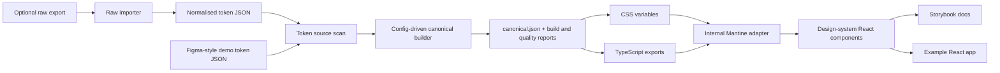

# Demo Design System Pipeline

This repo shows a complete design-system pipeline: design-token JSON shaped like a Figma token export is transformed into a canonical token contract, generated CSS variables, typed TypeScript exports, an internal Mantine theme adapter, public design-system React components, Storybook documentation, and a Vite example app.

It is intentionally generic. The token values, component copy, and app content are demo data so the repo can focus on the engineering shape of the pipeline rather than on a specific brand.

## Why This Exists

Design systems become easier to maintain when tokens are treated as a build artifact rather than hand-copied values. This demo shows how to keep one source of truth and generate the package outputs that applications actually consume.

The important idea is separation of concerns:

- Source token files model what a design tool exports, including primitive,
  semantic, and component-level values.
- `@demo-ds/token-pipeline` validates and converts that source shape.
- `@demo-ds/tokens` exposes generated CSS, JSON, and TypeScript contracts,
  including `component.*` tokens for wrapper variants and states.
- `@demo-ds/mantine-theme` keeps Mantine setup behind `DemoThemeProvider`.
- `@demo-ds/components` exposes the design-system component API; Mantine stays an internal rendering dependency.
- Storybook and the example app consume the packages through public exports.

## Pipeline



## Packages And Apps

```txt
packages/token-pipeline   build, validation, and scanner utilities
packages/tokens           generated token package
packages/mantine-theme    internal Mantine theme adapter and DemoThemeProvider
packages/components       public design-system component API
apps/storybook            token, theme, and component documentation
apps/example              Vite app proving package consumption
```

## Generated Token Outputs

`@demo-ds/tokens` generates and publishes the files downstream packages need:

- `canonical.json`: stable internal token contract.
- `tokens.css`: all `--ds-*` variables, including light/dark semantic selectors.
- `tokens.light.css` and `tokens.dark.css`: single-mode CSS outputs.
- `index.js` and `index.d.ts`: token maps, metadata, and `cssVar()`.
- `token-names.js` and `token-names.d.ts`: type-safe token names.
- `metadata.json` and `token-docs.json`: data for documentation and CI checks.
- `build-report.json`: source record counts, skipped records, path renames, generated files, and warnings.
- `token-quality.json` and `token-quality.md`: machine-readable and review-friendly token quality reports.

## Run Locally

Install dependencies:

```sh
pnpm install --frozen-lockfile
```

Run the full quality gate:

```sh
pnpm tokens:scan
pnpm tokens:quality
pnpm repo:scan
pnpm lint
pnpm typecheck
pnpm test
pnpm build
pnpm package:check
pnpm pack:check
pnpm release:check
pnpm architecture:check
pnpm format:check
```

Run Storybook:

```sh
pnpm storybook
```

Build the static Storybook site:

```sh
pnpm --filter @demo-ds/storybook build
```

The published Storybook is deployed from `main` by the `Storybook Pages`
workflow to:

```txt
https://jaminjadey.github.io/design-system/
```

Run the example app:

```sh
pnpm --filter @demo-ds/example dev
```

## Private Brand Token Input

Use `.private/design-system/` for real brand exports or local experiments that
must never be committed. The folder is ignored by Git, skipped by repo scans,
and protected by CI through `pnpm private:check`, which fails if anything under
`.private/` is force-added.

The public demo fixtures under `packages/tokens/fixtures/` must stay synthetic
and generic.

For local raw-export testing, put files here:

```txt
.private/design-system/
  import.config.json
  raw-token-export-files.json
```

Then run the importer into another private output folder:

```sh
pnpm tokens:import -- --input .private/design-system --output .private/normalised-token-output --config .private/design-system/import.config.json
```

The importer uses `import.config.json` to map raw files into the normalised
token-source files consumed by the rest of the pipeline. It strips source-tool
metadata, rejects forbidden markers, resolves common aliases, and writes an
`import-report.json` with emitted-token counts, stripped metadata counts, alias
counts, and file/path warnings.

In this public repo, do not copy private importer output into
`packages/tokens/fixtures/extracted`. In a private work repo, the same importer
can write to the token source directory that `@demo-ds/tokens` builds from.

Canonical mapping rules live in `token-pipeline.config.json`. Configure that
file when primitive groups, semantic groups, component groups, source mode
names, component leaf-name patterns, spacing/radius paths, typography fields,
or unsupported-token policy differ from the demo.

## How To Use The Packages

Wrap an app with the demo theme provider:

```tsx
import { DemoThemeProvider } from "@demo-ds/mantine-theme";
import { Button, Card, PageHeader, Select } from "@demo-ds/components";
import "@demo-ds/mantine-theme/styles.css";

export function App() {
  return (
    <DemoThemeProvider defaultColorScheme="light">
      <PageHeader title="Project overview" />
      <Card>
        <Button>New item</Button>
        <Select
          label="Status"
          data={[
            { value: "draft", label: "Draft" },
            { value: "live", label: "Live" }
          ]}
        />
      </Card>
    </DemoThemeProvider>
  );
}
```

Use token CSS variables in component CSS when a value belongs to the design system:

```css
.surface {
  background: var(--ds-color-background-card);
  border-radius: var(--ds-radius-md);
  padding: var(--ds-space-md);
}
```

Use component variables inside design-system wrappers when the value represents
a component decision from tokens:

```css
.button {
  background: var(--ds-component-button-primary-high-background);
  min-height: var(--ds-component-button-height-md);
}
```

Use TypeScript token names when code needs a token reference:

```ts
import { cssVar } from "@demo-ds/tokens";

const background = cssVar("color.semantic.background.body");
```

## Development Workflow

When token source files or mapping rules change:

```sh
pnpm tokens:scan
pnpm tokens:build
pnpm tokens:quality:check
pnpm --filter @demo-ds/tokens test
```

When theme or components change:

```sh
pnpm --filter @demo-ds/mantine-theme test
pnpm --filter @demo-ds/components test
pnpm --filter @demo-ds/storybook build
```

When the example app changes:

```sh
pnpm --filter @demo-ds/example build
```

Generated token outputs are committed so reviewers can inspect the contract without running the generator. After regenerating outputs, check drift with:

```sh
git diff -- packages/tokens/dist
```

## Documentation Map

| File                                        | Purpose                                                     |
| ------------------------------------------- | ----------------------------------------------------------- |
| `docs/00-product-vision.md`                 | What the demo proves and who it is for.                     |
| `docs/01-target-repo-structure.md`          | Monorepo layout and dependency direction.                   |
| `docs/02-token-source-and-demo-fixtures.md` | Demo token source shape and scanner expectations.           |
| `docs/03-canonical-token-model.md`          | Canonical token contract and naming rules.                  |
| `docs/04-token-build-pipeline.md`           | Build stages from source JSON to package outputs.           |
| `docs/05-generated-token-outputs.md`        | CSS, TypeScript, JSON, and docs data outputs.               |
| `docs/06-mantine-theme-generation.md`       | Mapping generated tokens into the internal Mantine adapter. |
| `docs/07-react-components-package.md`       | Component package architecture.                             |
| `docs/08-storybook-site.md`                 | Storybook documentation app.                                |
| `docs/09-example-react-app.md`              | Example app package-consumption pattern.                    |
| `docs/10-tests-and-quality-gates.md`        | Test strategy and quality gates.                            |
| `docs/11-ci-release-publishing.md`          | CI, versioning, and release approach.                       |
| `docs/13-acceptance-criteria.md`            | MVP and full-demo criteria.                                 |

## CI

GitHub Actions verifies the repo from a fresh checkout:

- install with `pnpm install --frozen-lockfile`
- scan demo token sources
- lint, typecheck, test, and build
- build Storybook and the example app
- run a Playwright smoke test against built Storybook
- verify the token quality report
- deploy Storybook to GitHub Pages after the Pages workflow succeeds
- verify package exports
- verify package tarball contents
- verify release dependency policy
- verify dependency direction and public API boundaries
- scan the repo for forbidden markers and secret-like patterns
- check formatting
- verify generated output drift

## Public Demo Rules

Keep the repo generic and reproducible:

- Use demo token values and generic sample content.
- Do not add private fonts, logos, screenshots, customer examples, internal URLs, or brand-specific naming.
- Do not hand-edit generated files.
- Keep package APIs documented and stable.
- Keep generation deterministic and protected by tests.
