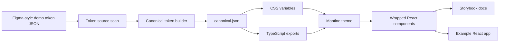

# Demo Design System Pipeline

This repo shows a complete design-system pipeline: design-token JSON shaped like a Figma token export is transformed into a canonical token contract, generated CSS variables, typed TypeScript exports, a Mantine theme, wrapped React components, Storybook documentation, and a Vite example app.

It is intentionally generic. The token values, component copy, and app content are demo data so the repo can focus on the engineering shape of the pipeline rather than on a specific brand.

## Why This Exists

Design systems become easier to maintain when tokens are treated as a build artifact rather than hand-copied values. This demo shows how to keep one source of truth and generate the package outputs that applications actually consume.

The important idea is separation of concerns:

- Source token files model what a design tool exports.
- `@demo-ds/token-pipeline` validates and converts that source shape.
- `@demo-ds/tokens` exposes generated CSS, JSON, and TypeScript contracts.
- `@demo-ds/mantine-theme` maps generated tokens into Mantine.
- `@demo-ds/components` wraps Mantine only where the design system needs fixed decisions.
- Storybook and the example app consume the packages through public exports.

## Pipeline



## Packages And Apps

```txt
packages/token-pipeline   build, validation, and scanner utilities
packages/tokens           generated token package
packages/mantine-theme    Mantine theme and DemoThemeProvider
packages/components       wrapped design-system components
apps/storybook            token, theme, and component documentation
apps/example              Vite app proving package consumption
```

## Generated Token Outputs

`@demo-ds/tokens` generates and publishes the files downstream packages need:

- `canonical.json`: stable internal token contract.
- `tokens.css`: all `--ds-*` variables, including light/dark semantic selectors.
- `tokens.light.css` and `tokens.dark.css`: single-mode CSS outputs.
- `index.js` and `index.d.ts`: token maps, metadata, and `cssVar()`.
- `token-names.js` and `token-names.d.ts`: type-safe token names.
- `metadata.json` and `token-docs.json`: data for documentation and CI checks.

## Run Locally

Install dependencies:

```sh
pnpm install --frozen-lockfile
```

Run the full quality gate:

```sh
pnpm tokens:scan
pnpm repo:scan
pnpm lint
pnpm typecheck
pnpm test
pnpm build
pnpm package:check
pnpm format:check
```

Run Storybook:

```sh
pnpm storybook
```

Run the example app:

```sh
pnpm --filter @demo-ds/example dev
```

## How To Use The Packages

Wrap an app with the demo theme provider:

```tsx
import { DemoThemeProvider } from '@demo-ds/mantine-theme';
import { Button, Card, PageHeader } from '@demo-ds/components';

export function App() {
  return (
    <DemoThemeProvider defaultColorScheme="light">
      <PageHeader title="Project overview" />
      <Card>
        <Button>New item</Button>
      </Card>
    </DemoThemeProvider>
  );
}
```

Use token CSS variables in component CSS when a value belongs to the design system:

```css
.surface {
  background: var(--ds-color-background-card);
  border-radius: var(--ds-radius-md);
  padding: var(--ds-space-md);
}
```

Use TypeScript token names when code needs a token reference:

```ts
import { cssVar } from '@demo-ds/tokens';

const background = cssVar('color.semantic.background.body');
```

## Development Workflow

When token source files or mapping rules change:

```sh
pnpm tokens:scan
pnpm --filter @demo-ds/tokens build
pnpm --filter @demo-ds/tokens test
```

When theme or components change:

```sh
pnpm --filter @demo-ds/mantine-theme test
pnpm --filter @demo-ds/components test
pnpm --filter @demo-ds/storybook build
```

When the example app changes:

```sh
pnpm --filter @demo-ds/example build
```

Generated token outputs are committed so reviewers can inspect the contract without running the generator. After regenerating outputs, check drift with:

```sh
git diff -- packages/tokens/dist
```

## Documentation Map

| File | Purpose |
| --- | --- |
| `docs/00-product-vision.md` | What the demo proves and who it is for. |
| `docs/01-target-repo-structure.md` | Monorepo layout and dependency direction. |
| `docs/02-token-source-and-demo-fixtures.md` | Demo token source shape and scanner expectations. |
| `docs/03-canonical-token-model.md` | Canonical token contract and naming rules. |
| `docs/04-token-build-pipeline.md` | Build stages from source JSON to package outputs. |
| `docs/05-generated-token-outputs.md` | CSS, TypeScript, JSON, and docs data outputs. |
| `docs/06-mantine-theme-generation.md` | Mapping generated tokens into Mantine. |
| `docs/07-react-components-package.md` | Component package architecture. |
| `docs/08-storybook-site.md` | Storybook documentation app. |
| `docs/09-example-react-app.md` | Example app package-consumption pattern. |
| `docs/10-tests-and-quality-gates.md` | Test strategy and quality gates. |
| `docs/11-ci-release-publishing.md` | CI, versioning, and release approach. |
| `docs/13-acceptance-criteria.md` | MVP and full-demo criteria. |

## CI

GitHub Actions verifies the repo from a fresh checkout:

- install with `pnpm install --frozen-lockfile`
- scan demo token sources
- lint, typecheck, test, and build
- build Storybook and the example app
- verify package exports
- scan the repo for forbidden markers and secret-like patterns
- check formatting
- verify generated output drift

## Public Demo Rules

Keep the repo generic and reproducible:

- Use demo token values and generic sample content.
- Do not add private fonts, logos, screenshots, customer examples, internal URLs, or brand-specific naming.
- Do not hand-edit generated files.
- Keep package APIs documented and stable.
- Keep generation deterministic and protected by tests.
