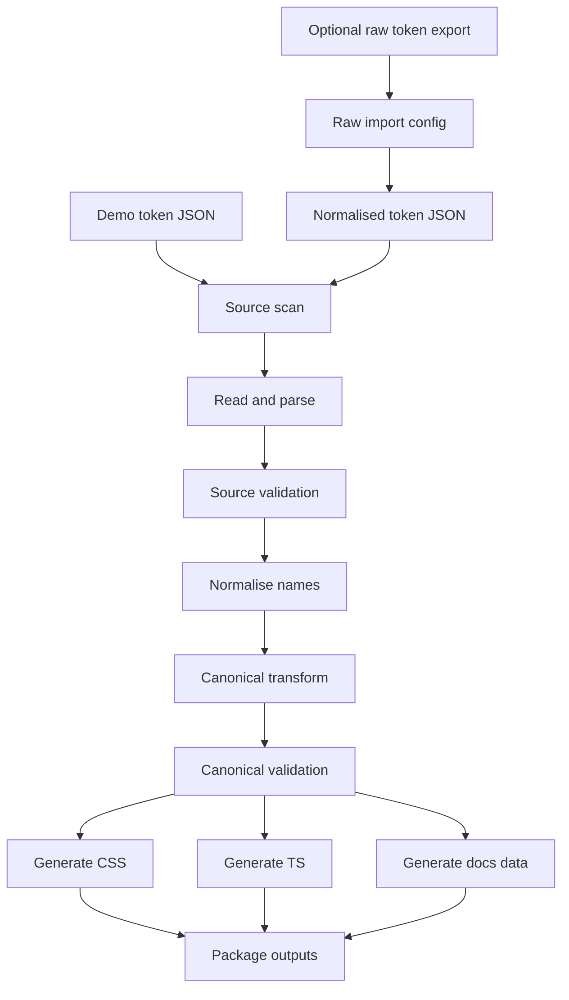

# 04 - Token Build Pipeline

## Pipeline Overview

The pipeline turns demo token source files into package artifacts.



The public repo uses synthetic demo token JSON directly. The raw import stage is
for private work repos or local experiments where the starting point is a raw
design-tool export.

## Optional Stage 0: Raw Export Import

Inputs:

```txt
.private/design-system/
  import.config.json
  raw-token-export-files.json
```

Responsibilities:

- Read only configured raw files.
- Strip source-tool metadata keys before output.
- Reject forbidden markers in remaining keys and values.
- Resolve slash aliases such as `Primitive colours/Primary/600`.
- Resolve brace aliases such as `{Primitive colours.Primary.600}`.
- Convert common colour objects with `Hex`, `Alpha`, `Components`, and
  `ColorSpace` fields into normalised colour tokens.
- Convert spacing and radius numbers into normalised numeric source tokens.
- Convert typography `FontSize`, `LineHeight`, and `FontWeight` groups into
  numeric source tokens.
- Write a deterministic `import-report.json`.

Command:

```sh
pnpm tokens:import -- --input .private/design-system --output .private/normalised-token-output --config .private/design-system/import.config.json
```

Keep the output under `.private/` when it contains real brand values. In a
private work repo, point the output directory at the token source directory used
by the package build.

## Stage 1: Fixture Discovery

Inputs:

```txt
packages/tokens/fixtures/extracted/primitives/Default.tokens.json
packages/tokens/fixtures/extracted/tokens/Light.tokens.json
packages/tokens/fixtures/extracted/tokens/Dark.tokens.json
packages/tokens/fixtures/extracted/components/Light.tokens.json
packages/tokens/fixtures/extracted/components/Dark.tokens.json
packages/tokens/fixtures/extracted/components/Dimensions.tokens.json
packages/tokens/fixtures/extracted/spacing/Mode 1.tokens.json
packages/tokens/fixtures/extracted/corners/Mode 1.tokens.json
packages/tokens/fixtures/extracted/typography/Default.tokens.json
```

Responsibilities:

- Confirm expected files exist.
- Confirm files are JSON.
- Confirm no unsupported binary files were introduced.
- Sort paths for deterministic processing.

## Stage 2: Source Scan

Responsibilities:

- Search for forbidden strings.
- Search for forbidden JSON keys.
- Fail on source-tool metadata.
- Produce a useful CI log.

Command:

```sh
pnpm tokens:scan
```

## Stage 3: Source Parsing

Responsibilities:

- Parse JSON files.
- Convert nested source objects into flat source-token records.
- Keep source path and file information for debugging.

Example source-token record:

```ts
interface SourceTokenRecord {
  file: string;
  sourcePath: string[];
  type: string;
  value: unknown;
}
```

## Stage 4: Source Validation

Responsibilities:

- Ensure each token has `$type` and `$value`.
- Ensure supported source `$type` values are handled.
- Ensure colour values have either `hex` or enough data to derive hex.
- Ensure typography groups have the expected properties.
- Fail clearly on unknown or malformed input.

## Stage 5: Normalisation And Mapping

Responsibilities:

- Convert source paths to canonical paths.
- Apply config-driven mapping rules for known source categories.
- Apply generic slugification for leaf names.
- Fix source naming issues, such as `Corder-radius` -> `radius`.

Mapping config:

```txt
token-pipeline.config.json
```

Configurable areas:

- Primitive colour source files and ignored path segments.
- Semantic colour source files, source mode names, and canonical light/dark modes.
- Semantic category prefixes.
- Component colour files, component dimension file, and component category prefixes.
- Spacing source file and size path index.
- Radius source file and size path index.
- Typography property names and style naming conventions.
- Unsupported token handling.

Implementation:

```txt
packages/token-pipeline/src/config/tokenPipelineConfig.ts
packages/token-pipeline/src/mapping/sourceToCanonical.ts
packages/token-pipeline/src/mapping/nameNormalisation.ts
```

Keep explicit mapping tables close to tests.

## Stage 6: Canonical Transform

Responsibilities:

- Convert source records into canonical token objects.
- Merge light and dark semantic colour files.
- Merge light and dark component colour files.
- Convert colour objects to hex strings.
- Convert spacing and radius numbers to dimension tokens with `px` unit.
- Convert component dimensions to `component.*` px tokens.
- Group typography attributes into coherent typography tokens.
- Attach source provenance for debugging.

Output:

```txt
packages/tokens/dist/canonical.json
```

## Stage 7: Canonical Validation

Responsibilities:

- Validate canonical schema.
- Ensure uniqueness of canonical token names.
- Ensure uniqueness of CSS variable names.
- Ensure no source-only metadata exists.
- Ensure all mode-aware tokens contain exactly `light` and `dark` keys.

## Stage 8: Output Generation

Generate:

```txt
packages/tokens/dist/canonical.json
packages/tokens/dist/tokens.css
packages/tokens/dist/tokens.light.css
packages/tokens/dist/tokens.dark.css
packages/tokens/dist/index.js
packages/tokens/dist/index.d.ts
packages/tokens/dist/token-names.js
packages/tokens/dist/token-names.d.ts
packages/tokens/dist/metadata.json
packages/tokens/dist/token-docs.json
packages/tokens/dist/build-report.json
packages/tokens/dist/token-quality.json
packages/tokens/dist/token-quality.md
```

Do not manually edit generated files.

`build-report.json` records source records read, tokens generated, mapped and
skipped records, renamed canonical paths, missing semantic/component modes,
generated files, and warnings.

`token-quality.json` and `token-quality.md` turn that build data into a quality
summary: token coverage by category and type, CSS output coverage, light/dark
mode completeness for semantic/component colours and shadows, naming validity,
source-file coverage, and findings.

## Stage 9: Package Build

Build TypeScript packages into distributable output:

```sh
pnpm --filter @demo-ds/token-pipeline build
pnpm --filter @demo-ds/tokens build
pnpm --filter @demo-ds/mantine-theme build
pnpm --filter @demo-ds/components build
```

## Stage 10: Documentation And App Build

Storybook and the example app should consume generated artifacts through package
exports.

```sh
pnpm --filter @demo-ds/storybook build
pnpm --filter @demo-ds/example build
```

## Recommended Scripts

At root:

```json
{
  "scripts": {
    "tokens:scan": "pnpm --filter @demo-ds/token-pipeline scan:fixtures",
    "tokens:import": "pnpm --filter @demo-ds/token-pipeline import:raw",
    "tokens:build": "pnpm --filter @demo-ds/tokens build",
    "tokens:quality": "pnpm tokens:build && pnpm tokens:quality:check",
    "tokens:quality:check": "node scripts/check-token-quality.mjs",
    "build": "turbo run build",
    "test": "turbo run test",
    "lint": "turbo run lint",
    "typecheck": "turbo run typecheck"
  }
}
```

## Failure Policy

Fail fast on:

- Missing fixture files.
- Invalid JSON.
- Forbidden markers.
- Unknown token types.
- Ambiguous or unresolved raw token aliases.
- Duplicate canonical names.
- Invalid colour values.
- Missing light/dark values.
- Generated output drift in CI.

## Output Drift Check

Regenerate outputs and verify the working tree is clean:

```sh
pnpm tokens:build
git diff --exit-code
```

This proves generated artifacts are committed and reproducible.
