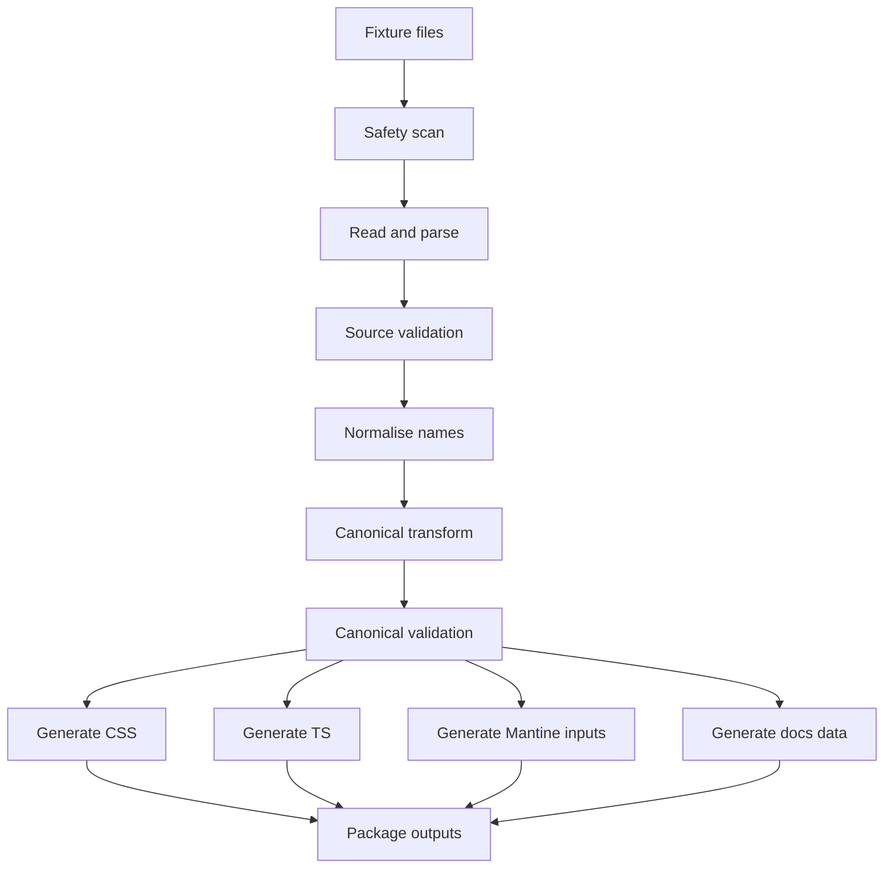

# 04 - Token build pipeline

## Pipeline overview

The pipeline turns sanitised source fixtures into generated artifacts.



## Stage 1: fixture preparation

Inputs:

```txt
packages/tokens/fixtures/extracted/primitives/Default.tokens.json
packages/tokens/fixtures/extracted/tokens/Light.tokens.json
packages/tokens/fixtures/extracted/tokens/Dark.tokens.json
packages/tokens/fixtures/extracted/spacing/Mode 1.tokens.json
packages/tokens/fixtures/extracted/corners/Mode 1.tokens.json
packages/tokens/fixtures/extracted/typography/Default.tokens.json
```

Responsibilities:

- Confirm expected files exist.
- Confirm files are JSON.
- Confirm no unsupported binary files were introduced.
- Make the file list deterministic by sorting paths.

Suggested command:

```sh
pnpm --filter @demo-ds/token-pipeline prepare:fixtures
```

## Stage 2: safety scan

Responsibilities:

- Search for forbidden strings.
- Search for forbidden JSON keys.
- Fail on source-tool metadata.
- Produce a machine-readable report for CI.

Suggested outputs:

```txt
packages/tokens/generated/reports/safety-report.json
packages/tokens/generated/reports/safety-report.md
```

Suggested command:

```sh
pnpm --filter @demo-ds/token-pipeline scan:fixtures
```

## Stage 3: source parsing

Responsibilities:

- Parse JSON files.
- Convert nested source objects into flat source-token records.
- Keep source path and file information for debugging.

Example source-token record:

```ts
interface SourceTokenRecord {
  file: string;
  sourcePath: string[];
  type: string;
  value: unknown;
}
```

## Stage 4: source validation

Responsibilities:

- Ensure each token has `$type` and `$value`.
- Ensure supported source `$type` values are handled.
- Ensure colour values have either `hex` or enough data to derive hex.
- Ensure typography groups have the expected properties.
- Fail clearly on unknown or malformed input.

Unknown tokens should fail by default in the MVP. Once the pipeline is mature, unknown tokens can be reported as warnings if needed.

## Stage 5: normalisation and mapping

Responsibilities:

- Convert source paths to canonical paths.
- Apply explicit mapping rules for known source categories.
- Apply generic slugification for leaf names.
- Fix source naming issues, such as `Corder-radius` -> `radius`.

Suggested implementation:

```txt
packages/token-pipeline/src/mapping/sourceToCanonical.ts
packages/token-pipeline/src/mapping/nameNormalisation.ts
```

Keep explicit mapping tables close to tests.

## Stage 6: canonical transform

Responsibilities:

- Convert source records into canonical token objects.
- Merge light and dark semantic colour files.
- Convert colour objects to hex strings.
- Convert spacing and radius numbers to dimension tokens with `px` unit.
- Group typography attributes into coherent typography tokens.
- Attach source provenance for debugging.

Suggested command:

```sh
pnpm --filter @demo-ds/tokens build:canonical
```

Suggested output:

```txt
packages/tokens/dist/canonical.json
```

## Stage 7: canonical validation

Responsibilities:

- Validate canonical schema.
- Ensure uniqueness of canonical token names.
- Ensure uniqueness of CSS variable names.
- Ensure no source-only metadata exists.
- Ensure all mode-aware tokens contain exactly `light` and `dark` keys.

Suggested command:

```sh
pnpm --filter @demo-ds/tokens validate:canonical
```

## Stage 8: output generation

Generate the following outputs:

```txt
packages/tokens/dist/canonical.json
packages/tokens/dist/tokens.css
packages/tokens/dist/tokens.light.css
packages/tokens/dist/tokens.dark.css
packages/tokens/dist/index.ts
packages/tokens/dist/token-names.ts
packages/tokens/dist/metadata.json
packages/mantine-theme/src/generated/themeTokens.ts
```

Do not manually edit generated files.

## Stage 9: package build

Build TypeScript packages into distributable output.

Suggested package-level commands:

```sh
pnpm --filter @demo-ds/token-pipeline build
pnpm --filter @demo-ds/tokens build
pnpm --filter @demo-ds/mantine-theme build
pnpm --filter @demo-ds/components build
```

## Stage 10: documentation build

Storybook should consume generated artifacts rather than duplicating token values.

Suggested command:

```sh
pnpm --filter @demo-ds/storybook build
```

## Recommended script naming

At root:

```json
{
  "scripts": {
    "tokens:scan": "pnpm --filter @demo-ds/token-pipeline scan:fixtures",
    "tokens:build": "pnpm --filter @demo-ds/tokens build",
    "tokens:check": "pnpm tokens:scan && pnpm --filter @demo-ds/tokens test",
    "build": "turbo run build",
    "test": "turbo run test",
    "lint": "turbo run lint",
    "typecheck": "turbo run typecheck"
  }
}
```

Inside `packages/tokens/package.json`:

```json
{
  "scripts": {
    "clean": "rimraf dist generated",
    "build": "pnpm clean && token-pipeline build --fixtures ./fixtures/extracted --out ./dist",
    "test": "vitest run",
    "validate": "token-pipeline validate --canonical ./dist/canonical.json"
  }
}
```

## Failure policy

Fail fast on:

- Missing fixture files.
- Invalid JSON.
- Forbidden markers.
- Unknown token types.
- Duplicate canonical names.
- Invalid colour values.
- Missing light/dark values.
- Generated output drift in CI.

## Output drift check

Add a CI check that regenerates outputs and verifies the working tree is clean:

```sh
pnpm tokens:build
git diff --exit-code
```

This proves generated artifacts are committed and reproducible.
