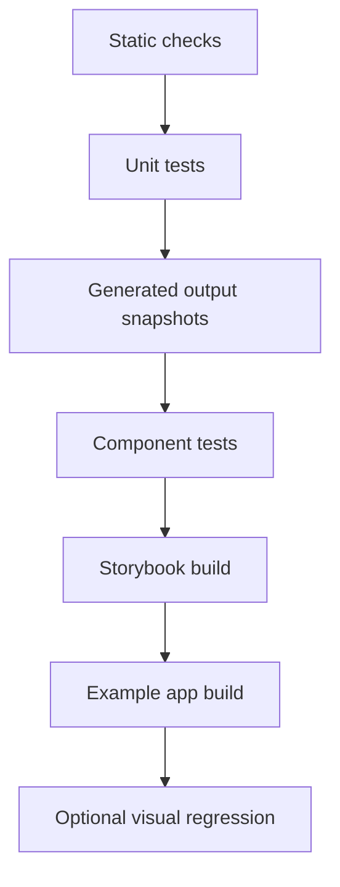

# 10 - Tests and quality gates

## Test pyramid



## Required quality gates

Every CI run should check:

```sh
pnpm install --frozen-lockfile
pnpm lint
pnpm typecheck
pnpm test
pnpm build
pnpm tokens:scan
pnpm tokens:quality:check
git diff --exit-code
```

The `git diff --exit-code` step should happen after generation to prove outputs are reproducible.

## Token pipeline tests

Package:

```txt
packages/token-pipeline
```

Test categories:

| Test                       | Purpose                                                             |
| -------------------------- | ------------------------------------------------------------------- |
| Safety scanner tests       | Forbidden terms and metadata are detected.                          |
| Source parser tests        | Nested source JSON becomes source records.                          |
| Name normalisation tests   | Source labels map to canonical names.                               |
| Colour conversion tests    | Source colour objects become hex values.                            |
| Mode merge tests           | Light and dark semantic tokens merge correctly.                     |
| Typography grouping tests  | FontSize/LineHeight/FontWeight become one token.                    |
| Configurable mapping tests | Alternate source files, modes, and category prefixes map correctly. |
| Import/build report tests  | Reports include useful counts, warnings, and source paths.          |
| Canonical validation tests | Invalid canonical documents fail.                                   |

Example cases:

```txt
normaliseName('Default text') -> 'default-text'
sourcePathToCanonical(['Font colours', 'Default text']) -> 'color.semantic.text.default'
sourcePathToCanonical(['Corder-radius', 'Corner-Med']) -> 'radius.md'
```

## Generated output tests

Package:

```txt
packages/tokens
```

Test categories:

- Generated `canonical.json` matches schema.
- Generated CSS contains expected variables.
- Generated CSS contains light and dark selectors.
- Generated TypeScript exports expected token names.
- Generated build report explains source records, skipped records, and generated files.
- Generated token quality reports explain token counts, CSS coverage, mode coverage, and findings.
- No forbidden markers appear in generated outputs.
- Running generation twice produces the same output.

## Mantine theme tests

Package:

```txt
packages/mantine-theme
```

Test categories:

- `demoTheme` contains `primaryColor`.
- `demoTheme.colors.primary` has the expected shade count.
- `demoTheme.spacing` has required keys.
- `demoTheme.radius` has required keys.
- `demoTheme.headings.sizes.h1` exists.
- `DemoThemeProvider` renders children.
- No private font names appear.

## Component tests

Package:

```txt
packages/components
```

Use React Testing Library for DOM-oriented tests. Tests should focus on behaviour and accessible output rather than internal implementation details.

Test categories:

- Component renders.
- Important props map to expected DOM output.
- Accessibility attributes exist.
- Disabled/loading/error states work.
- Keyboard-relevant interactions work.

## Storybook checks

App:

```txt
apps/storybook
```

Required:

```sh
pnpm --filter @demo-ds/storybook build
pnpm --filter @demo-ds/storybook test
```

Current:

- Accessibility addon configured to fail on violations.
- Playwright QA tests against built Storybook.
- Light/dark checks for every built docs and story entry.
- Browser console, runtime error, failed response, and axe checks.

Optional later:

- Storybook test runner.
- Visual regression screenshots.

## Example app checks

App:

```txt
apps/example
```

Required:

```sh
pnpm --filter @demo-ds/example build
```

Optional:

- Playwright navigation smoke test.
- Screenshot smoke test for light and dark mode.

## Static checks

Use:

- TypeScript strict mode.
- ESLint.
- Stylelint.
- Prettier.
- Package export checks.
- Dependency boundary checks.

## Security and public-demo checks

Add a custom check for forbidden markers across the full repo:

```sh
pnpm repo:scan
```

It should scan:

- Fixture files.
- Source files.
- Generated outputs.
- Docs.
- Storybook content.
- Example app copy.

Use a small allowlist for this documentation pack if it intentionally names forbidden markers as examples. In source and package output, there should be no such markers.

## Snapshot policy

Use snapshots for generated artifacts, not for every component DOM tree.

Good snapshots:

- Canonical token JSON.
- CSS variables output.
- TypeScript token-name output.
- Mantine token mapping output.

Avoid snapshots for:

- Large Storybook HTML output.
- Components where semantic assertions are clearer.
- Files containing timestamps.

## CI matrix

For a demo repo, one current LTS Node version is enough. If publishing packages, add one extra maintained Node version.

Example:

```yaml
strategy:
  matrix:
    node: [22]
```

Update the Node version intentionally rather than using an unpinned action default.

## Definition of healthy pipeline

The pipeline is healthy when:

- A fixture change produces an understandable generated diff.
- A bad fixture fails before output generation.
- A mapping change is covered by tests.
- Storybook and example app both consume package exports.
- The generated CSS and Mantine theme agree on naming.
- CI catches generated output drift.
