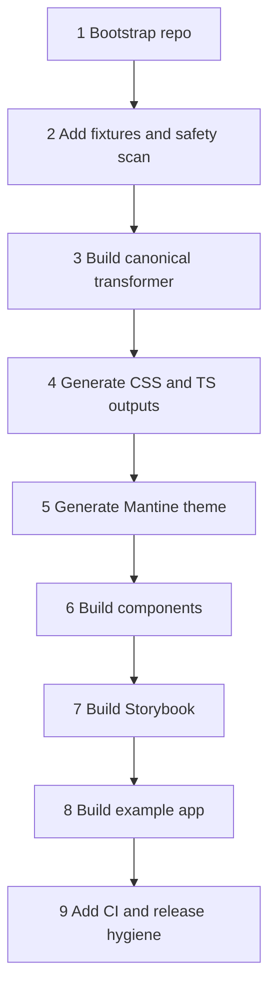

# 12 - Codex work plan

## How to use Codex for this repo

Use Codex in small, ordered tasks. Each task should have a clear input, output, acceptance criteria, and test command.

Keep `AGENTS.md` in the repository root so Codex has durable project guidance. Start each Codex task by pointing it at the relevant documentation file and asking it to implement only that slice.

## Recommended order



## Task 1: bootstrap monorepo

Prompt file:

```txt
docs/codex/prompt-01-bootstrap-monorepo.md
```

Acceptance criteria:

- pnpm workspace exists.
- Packages and apps exist with placeholder files.
- TypeScript, lint, format, test, and build scripts are wired.
- Root commands run.

## Task 2: fixtures and source scan

Prompt file:

```txt
docs/codex/prompt-02-fixtures-and-safety.md
```

Acceptance criteria:

- Sanitised fixture files are in `packages/tokens/fixtures`.
- Safety scanner exists and is tested.
- Forbidden markers fail tests.
- Fixture scan passes on demo fixtures.

## Task 3: canonical transformer

Prompt file:

```txt
docs/codex/prompt-03-canonical-transformer.md
```

Acceptance criteria:

- Source files parse into source records.
- Canonical token model exists.
- Light/dark semantic tokens merge.
- Typography groups merge.
- Canonical output validates.
- Tests cover important mappings.

## Task 4: generated outputs

Prompt file:

```txt
docs/codex/prompt-04-generated-outputs.md
```

Acceptance criteria:

- CSS variables generated.
- TypeScript token exports generated.
- Metadata generated.
- Build is deterministic.
- Snapshot tests pass.

## Task 5: Mantine theme

Prompt file:

```txt
docs/codex/prompt-05-mantine-theme.md
```

Acceptance criteria:

- Mantine theme package builds.
- Provider renders children.
- Theme maps colours, spacing, radius, typography.
- No private fonts or hardcoded source values.

## Task 6: components

Prompt file:

```txt
docs/codex/prompt-06-components-and-stories.md
```

Acceptance criteria:

- Initial components exist.
- Components use Mantine internally and expose design-system-owned props.
- Unit tests pass.
- Stories exist for each component.

## Task 7: Storybook

Prompt file:

```txt
docs/codex/prompt-07-storybook-site.md
```

Acceptance criteria:

- Storybook app builds.
- Theme provider decorator works.
- Token docs render from generated data.
- Component stories render.

## Task 8: example app

Prompt file:

```txt
docs/codex/prompt-08-example-app.md
```

Acceptance criteria:

- Example app runs and builds.
- App consumes published-style package exports.
- Light/dark mode works.
- Generic pages demonstrate components.

## Task 9: CI and hardening

Prompt file:

```txt
docs/codex/prompt-09-tests-ci-release.md
```

Acceptance criteria:

- GitHub Actions CI exists.
- Build/test/lint/typecheck/safety scan run in CI.
- Generated output drift check exists.
- Storybook build is included.
- Release notes/package strategy is documented.

## Codex prompt pattern

Use prompts with this structure:

```txt
You are working in this repo. Follow AGENTS.md.
Read docs/<relevant-file>.md before editing.
Implement only <specific task>.
Do not add raw private tokens, private assets, or brand-specific names.
Add tests for all new logic.
Run <commands> and report results.
```

## Review pattern

After each Codex task:

1. Review changed files.
2. Check generated output diffs.
3. Run relevant commands locally.
4. Commit the task separately.
5. Move to the next task.

## Keep tasks small

Avoid one giant Codex instruction like:

```txt
Build the whole design system repo.
```

That is too broad. Use the prompt files in order instead.
